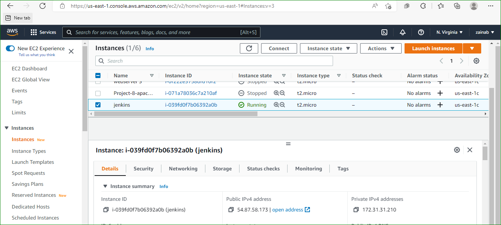
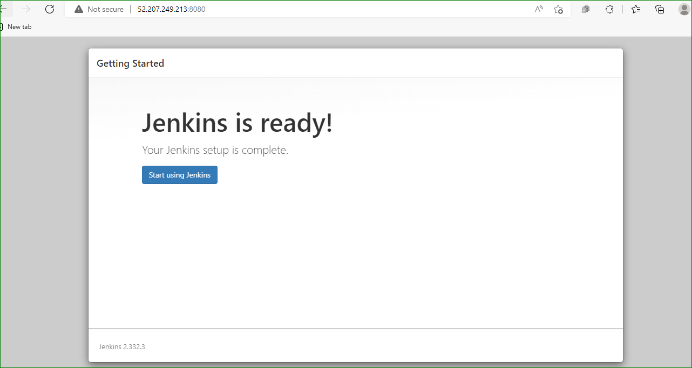
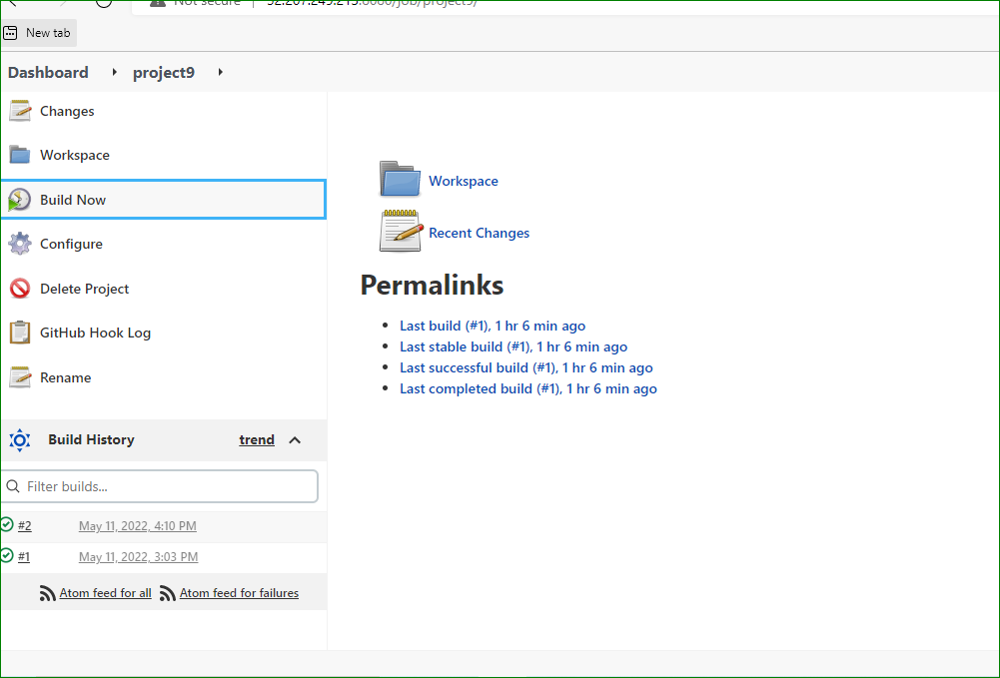
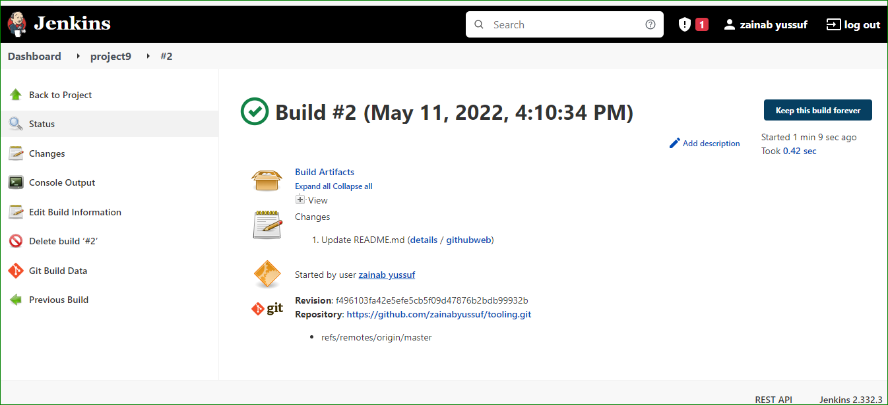
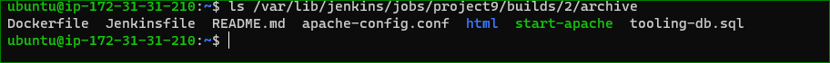
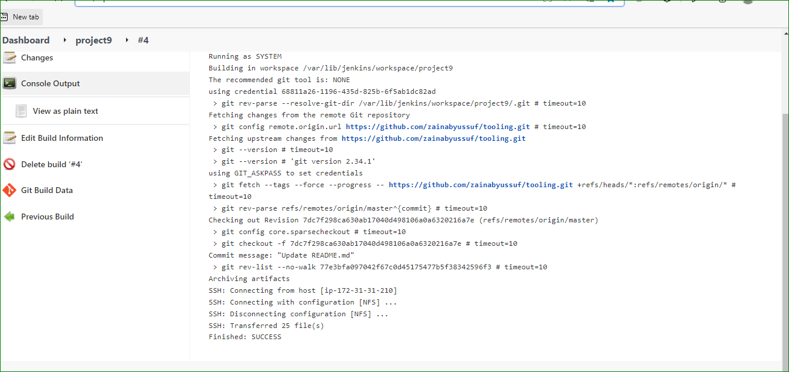
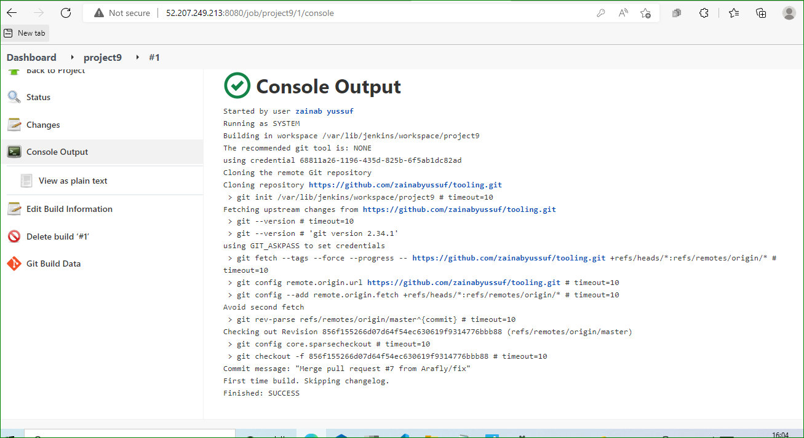

#TOOLING WEBSITE DEPLOYMENT WITH JENKINS

*Create an AWS EC2 server based on Ubuntu Server 20.04 LTS and name it "Jenkins"

96-`sudo apt update`

`sudo apt install default-jdk-headless`

`wget -q -O - https://pkg.jenkins.io/debian-stable/jenkins.io.key | sudo apt-key add -`

`sudo sh -c 'echo deb https://pkg.jenkins.io/debian-stable binary/ > \
    /etc/apt/sources.list.d/jenkins.list'`

`sudo apt update`

`sudo apt-get install jenkins`

`sudo systemctl status jenkins`

http://<Jenkins-Server-Public-IP-Address-or-Public-DNS-Name>:8080

`sudo cat /var/lib/jenkins/secrets/initialAdminPassword`

`ls /var/lib/jenkins/jobs/tooling_github/builds/<build_number>/archive/`

